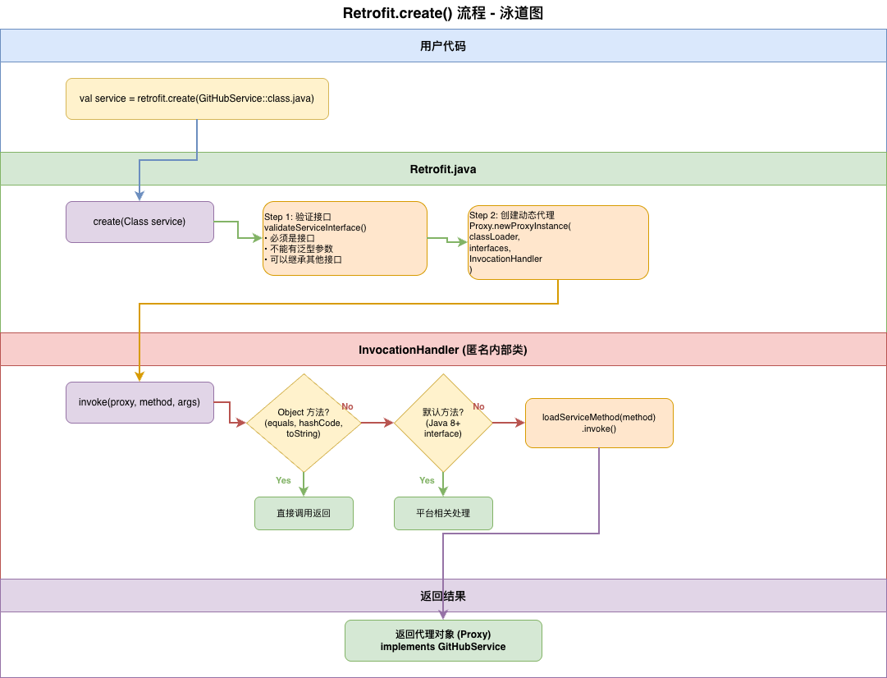

# Retrofit 流程图（Mermaid 版本）

> 这些流程图可以直接在 GitHub 上渲染查看

## 1. Retrofit.create() 流程

### 简化版（快速理解）
````mermaid
flowchart TD
    Start([用户调用<br/>retrofit.create]) --> Validate[验证接口合法性<br/>validateServiceInterface]
    Validate --> Proxy[创建动态代理<br/>Proxy.newProxyInstance]
    Proxy --> Handler[创建 InvocationHandler<br/>拦截方法调用]
    Handler --> Return([返回代理对象<br/>implements GitHubService])

    style Start fill:#e1f5ff
    style Return fill:#e1f5ff
    style Proxy fill:#fff3e0
    style Handler fill:#f3e5f5
````

### 详细版（深入学习）
````mermaid
flowchart TD
    Start([用户代码<br/>val service = retrofit.create<br/>GitHubService::class.java]) --> Validate

    Validate[Step 1: 验证接口<br/>validateServiceInterface<br/>• 必须是 interface<br/>• 不能有泛型参数] --> CheckValid{验证通过?}

    CheckValid -->|No| Error1([抛出 IllegalArgumentException])
    CheckValid -->|Yes| Proxy

    Proxy[Step 2: 创建动态代理<br/>Proxy.newProxyInstance<br/>• ClassLoader<br/>• Interface array<br/>• InvocationHandler] --> Handler

    Handler[Step 3: 创建拦截器<br/>InvocationHandler.invoke<br/>拦截所有方法调用] --> CheckMethod{方法类型?}

    CheckMethod -->|Object 方法| DirectCall[直接调用<br/>equals/hashCode/toString]
    CheckMethod -->|默认方法| PlatformCall[平台相关处理<br/>Java 8+ default method]
    CheckMethod -->|API 方法| LoadService[loadServiceMethod<br/>解析注解并调用]

    DirectCall --> Return
    PlatformCall --> Return
    LoadService --> Return

    Return([返回代理对象<br/>动态实现了 GitHubService])

    style Start fill:#e1f5ff
    style Return fill:#e1f5ff
    style Proxy fill:#fff3e0
    style Handler fill:#f3e5f5
    style Error1 fill:#ffebee
````

---

## 2. 完整请求执行流程

### 简化版（快速理解）
````mermaid
flowchart TD
    Start([用户调用<br/>service.listRepos]) --> Invoke[InvocationHandler<br/>拦截调用]
    Invoke --> Load[loadServiceMethod<br/>加载方法元数据]
    Load --> Parse[解析注解<br/>构建请求]
    Parse --> Execute[OkHttp<br/>执行网络请求]
    Execute --> Convert[Converter<br/>转换响应]
    Convert --> Return([返回结果<br/>List&lt;Repo&gt;])

    style Start fill:#e1f5ff
    style Return fill:#e1f5ff
    style Execute fill:#fff3e0
    style Convert fill:#f3e5f5
````

### 详细版（深入学习）
````mermaid
flowchart TD
    Start([用户代码<br/>val repos = service.listRepos]) --> Invoke

    Invoke[InvocationHandler.invoke<br/>Retrofit.java:191] --> Load

    Load[loadServiceMethod<br/>Retrofit.java:146] --> Cache{检查缓存?}

    Cache -->|有缓存| ReturnCache[返回缓存的<br/>ServiceMethod]
    Cache -->|无缓存| ParseService[ServiceMethod<br/>.parseAnnotations]

    ParseService --> ParseRequest[RequestFactory<br/>解析方法和参数注解<br/>• @GET, @POST<br/>• @Path, @Query, @Body]

    ParseRequest --> ParseHttp[HttpServiceMethod<br/>.parseAnnotations]

    ParseHttp --> GetAdapter[获取 CallAdapter<br/>适配返回类型<br/>• Call&lt;T&gt;<br/>• suspend fun<br/>• Observable&lt;T&gt;]

    GetAdapter --> GetConverter[获取 Converter<br/>数据转换<br/>• Gson<br/>• Moshi<br/>• Protobuf]

    GetConverter --> CreateMethod[创建 ServiceMethod<br/>• CallAdapted<br/>• SuspendForResponse]

    CreateMethod --> CacheIt[缓存到 Map<br/>双重检查锁 DCL]

    CacheIt --> ReturnCache

    ReturnCache --> InvokeMethod[ServiceMethod.invoke<br/>HttpServiceMethod.java:134]

    InvokeMethod --> CreateCall[创建 OkHttpCall<br/>• RequestFactory<br/>• args<br/>• OkHttpClient<br/>• Converter]

    CreateCall --> Adapt[CallAdapter.adapt<br/>适配不同返回类型]

    Adapt --> BuildRequest[构建 Request<br/>• URL<br/>• Method<br/>• Headers<br/>• Body]

    BuildRequest --> OkHttp[OkHttp 执行<br/>execute / enqueue]

    OkHttp --> Network[网络请求<br/>• 拦截器链<br/>• 连接池<br/>• Socket]

    Network --> Response{HTTP 状态码?}

    Response -->|2xx 成功| ConvertBody[Converter.convert<br/>ResponseBody → T<br/>Gson 解析 JSON]
    Response -->|4xx/5xx| ErrorResponse[构造错误响应<br/>Response.error]

    ConvertBody --> Success[Response.success<br/>包装结果]

    Success --> AdaptReturn[CallAdapter 处理返回<br/>• 协程: 直接返回 T<br/>• Call: 返回 Call&lt;T&gt;]

    ErrorResponse --> AdaptReturn

    AdaptReturn --> Return([返回给用户<br/>List&lt;Repo&gt;])

    style Start fill:#e1f5ff
    style Return fill:#e1f5ff
    style OkHttp fill:#fff3e0
    style ConvertBody fill:#f3e5f5
    style ErrorResponse fill:#ffebee
    style Cache fill:#e8f5e9
    style CacheIt fill:#e8f5e9
````

---

## 3. 时序图版本（可选）

### 方法调用时序图
````mermaid
sequenceDiagram
    participant User as 用户代码
    participant Proxy as 动态代理
    participant Retrofit as Retrofit
    participant SM as ServiceMethod
    participant HSM as HttpServiceMethod
    participant Call as OkHttpCall
    participant OkHttp as OkHttp
    participant Conv as Converter

    User->>Proxy: service.listRepos("square")
    Proxy->>Retrofit: invoke(method, args)
    Retrofit->>Retrofit: loadServiceMethod(method)

    alt 缓存存在
        Retrofit-->>Retrofit: 返回缓存
    else 缓存不存在
        Retrofit->>SM: parseAnnotations()
        SM->>HSM: parseAnnotations()
        HSM->>HSM: 解析注解
        HSM->>HSM: 获取 CallAdapter
        HSM->>HSM: 获取 Converter
        HSM-->>SM: 返回 HttpServiceMethod
        SM-->>Retrofit: 返回 ServiceMethod
        Retrofit->>Retrofit: 缓存 ServiceMethod
    end

    Retrofit->>SM: invoke(args)
    SM->>Call: 创建 OkHttpCall
    Call->>Call: 构建 Request
    Call->>OkHttp: execute()
    OkHttp->>OkHttp: 网络请求
    OkHttp-->>Call: Response
    Call->>Conv: convert(responseBody)
    Conv-->>Call: List<Repo>
    Call-->>SM: Response.success
    SM-->>Proxy: List<Repo>
    Proxy-->>User: List<Repo>

    Note over User,Conv: 整个流程在协程中是挂起的<br/>对于 Call<T> 则是异步回调
````

---

## 4. 注解解析流程
````mermaid
flowchart TD
    Start([RequestFactory<br/>.parseAnnotations]) --> ParseMethod[解析方法注解]

    ParseMethod --> MethodType{方法注解类型?}

    MethodType -->|@GET| GET[httpMethod = GET<br/>hasBody = false]
    MethodType -->|@POST| POST[httpMethod = POST<br/>hasBody = true]
    MethodType -->|@PUT| PUT[httpMethod = PUT<br/>hasBody = true]
    MethodType -->|@DELETE| DELETE[httpMethod = DELETE<br/>hasBody = false]
    MethodType -->|@PATCH| PATCH[httpMethod = PATCH<br/>hasBody = true]

    GET --> ParsePath[解析路径<br/>users/{user}/repos]
    POST --> ParsePath
    PUT --> ParsePath
    DELETE --> ParsePath
    PATCH --> ParsePath

    ParsePath --> ParseParams[解析参数注解]

    ParseParams --> ParamType{参数注解类型?}

    ParamType -->|@Path| PathParam[替换路径变量<br/>{user} → square]
    ParamType -->|@Query| QueryParam[添加查询参数<br/>?sort=stars]
    ParamType -->|@QueryMap| QueryMapParam[批量查询参数<br/>Map → Query String]
    ParamType -->|@Body| BodyParam[设置请求体<br/>JSON 序列化]
    ParamType -->|@Header| HeaderParam[添加请求头<br/>Authorization: xxx]
    ParamType -->|@Field| FieldParam[表单字段<br/>Form URL Encoded]

    PathParam --> BuildFactory[构建 RequestFactory]
    QueryParam --> BuildFactory
    QueryMapParam --> BuildFactory
    BodyParam --> BuildFactory
    HeaderParam --> BuildFactory
    FieldParam --> BuildFactory

    BuildFactory --> Return([返回 RequestFactory<br/>用于后续构建 Request])

    style Start fill:#e1f5ff
    style Return fill:#e1f5ff
    style GET fill:#c8e6c9
    style POST fill:#fff9c4
    style PUT fill:#ffe0b2
    style DELETE fill:#ffcdd2
    style PATCH fill:#e1bee7
````

---

## 5. CallAdapter 选择流程
````mermaid
flowchart TD
    Start([HttpServiceMethod<br/>createCallAdapter]) --> GetFactories[获取所有 CallAdapter.Factory]

    GetFactories --> Loop{遍历 Factory}

    Loop --> TryGet[factory.get<br/>returnType, annotations, retrofit]

    TryGet --> Match{返回 CallAdapter?}

    Match -->|null| Loop
    Match -->|非 null| Found[找到匹配的 CallAdapter]

    Loop -->|遍历完毕| NotFound[未找到匹配的 Adapter]

    NotFound --> Error([抛出异常<br/>Unable to create call adapter])

    Found --> AdapterType{Adapter 类型?}

    AdapterType -->|DefaultCallAdapter| Default[适配 Call&lt;T&gt;<br/>返回 ExecutorCallbackCall]
    AdapterType -->|SuspendForResponse| Suspend[适配 suspend fun<br/>挂起并返回 T]
    AdapterType -->|RxJava2CallAdapter| RxJava[适配 Observable&lt;T&gt;<br/>返回 RxJava Observable]
    AdapterType -->|其他| Custom[自定义适配器<br/>适配其他类型]

    Default --> Return([返回 CallAdapter])
    Suspend --> Return
    RxJava --> Return
    Custom --> Return

    style Start fill:#e1f5ff
    style Return fill:#e1f5ff
    style Error fill:#ffebee
    style Default fill:#e3f2fd
    style Suspend fill:#f3e5f5
    style RxJava fill:#fff3e0
````

---

## 6. 缓存机制（重点）
````mermaid
flowchart TD
    Start([loadServiceMethod<br/>method]) --> Check1{第一次检查缓存<br/>serviceMethodCache.get}

    Check1 -->|有缓存| Return1([直接返回<br/>O1 时间复杂度])

    Check1 -->|无缓存| Lock[synchronized<br/>获取锁]

    Lock --> Check2{第二次检查缓存<br/>Double Check}

    Check2 -->|有缓存| Return2([返回缓存<br/>避免重复解析])

    Check2 -->|无缓存| Parse[ServiceMethod<br/>.parseAnnotations<br/>解析注解]

    Parse --> Time[耗时操作<br/>• 反射解析注解<br/>• 创建 RequestFactory<br/>• 获取 CallAdapter<br/>• 获取 Converter]

    Time --> Cache[缓存到 Map<br/>serviceMethodCache.put]

    Cache --> Return3([返回 ServiceMethod])

    Note1[为什么双重检查锁?<br/>1. 避免重复加锁影响性能<br/>2. 避免多线程重复解析<br/>3. 保证线程安全]

    style Start fill:#e1f5ff
    style Return1 fill:#c8e6c9
    style Return2 fill:#c8e6c9
    style Return3 fill:#e1f5ff
    style Lock fill:#fff9c4
    style Parse fill:#ffccbc
    style Time fill:#ffccbc
````

---

## 使用说明

### 在 Markdown 中使用

1. **直接复制粘贴**到你的 `.md` 文件中
2. **GitHub 会自动渲染** Mermaid 图表
3. **可以在 Obsidian、Typora 等编辑器中预览**

### 优势

✅ **版本控制友好** - 纯文本，方便 diff
✅ **实时渲染** - GitHub、GitLab 原生支持
✅ **易于修改** - 不需要打开绘图工具
✅ **多端同步** - 可以在任何支持 Mermaid 的平台查看

### 组合使用

推荐在笔记中同时提供：
````markdown
## 流程图

### 详细版（PNG）


### 简化版（Mermaid - 可交互）

````
