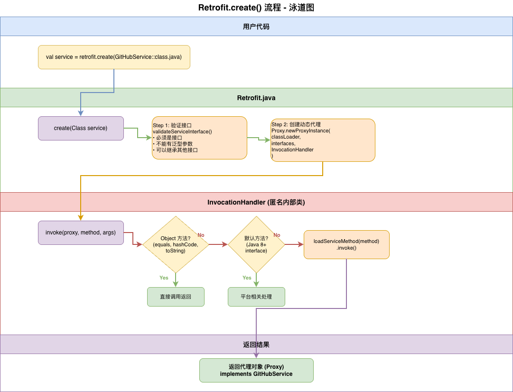

# Retrofit 动态代理机制

> 学习日期：2025-10-28
> 学习进度：🔄 进行中

## 📊 流程图

### 整体流程



**或查看交互式版本**：
````mermaid
flowchart TD
    Start([用户调用<br/>retrofit.create]) --> Validate[验证接口合法性<br/>validateServiceInterface]
    Validate --> Proxy[创建动态代理<br/>Proxy.newProxyInstance]
    Proxy --> Handler[创建 InvocationHandler<br/>拦截方法调用]
    Handler --> Return([返回代理对象<br/>implements GitHubService])

    style Start fill:#e1f5ff
    style Return fill:#e1f5ff
    style Proxy fill:#fff3e0
    style Handler fill:#f3e5f5
````

## 🔍 核心源码分析

### Retrofit.create() 方法
````java
// Retrofit.java:170
public <T> T create(final Class<T> service) {
    // Step 1: 验证接口
    validateServiceInterface(service);

    // Step 2: 创建动态代理
    return (T) Proxy.newProxyInstance(
        service.getClassLoader(),
        new Class<?>[] {service},
        new InvocationHandler() {
            private final Platform platform = Platform.get();

            @Override
            public Object invoke(Object proxy, Method method, Object[] args) {
                // Object 方法直接调用
                if (method.getDeclaringClass() == Object.class) {
                    return method.invoke(this, args);
                }

                // 平台相关的默认方法
                if (platform.isDefaultMethod(method)) {
                    return platform.invokeDefaultMethod(method, service, proxy, args);
                }

                // 核心：加载并调用 ServiceMethod
                return loadServiceMethod(method).invoke(args);
            }
        }
    );
}
````

### 关键学习点

#### 1️⃣ 为什么使用动态代理？

**优势**：
- ✅ 无需手动编写实现类
- ✅ 运行时灵活修改行为（如动态 BaseUrl）
- ✅ 代码简洁，减少样板代码

**权衡**：
- ⚠️ 反射性能略低（但有缓存优化）
- ⚠️ 调试稍困难（需要理解代理机制）

**对比注解处理器（APT）**：

| 特性 | 动态代理 | 注解处理器 |
|------|---------|-----------|
| 实现方式 | 运行时生成 | 编译期生成 |
| 灵活性 | ⭐⭐⭐⭐⭐ | ⭐⭐⭐ |
| 性能 | ⭐⭐⭐⭐ | ⭐⭐⭐⭐⭐ |
| 调试难度 | 较难 | 容易 |
| 配置修改 | 运行时 | 编译期 |

**结论**：Retrofit 选择动态代理，牺牲少量性能换取灵活性。

#### 2️⃣ InvocationHandler 的作用
````java
new InvocationHandler() {
    @Override
    public Object invoke(Object proxy, Method method, Object[] args) {
        // 所有方法调用都会被拦截到这里
        return loadServiceMethod(method).invoke(args);
    }
}
````

**工作原理**：
1. 用户调用 `service.listRepos("square")`
2. JVM 发现这是代理对象，调用 InvocationHandler.invoke()
3. InvocationHandler 分析 Method 对象，解析注解
4. 构建 HTTP 请求，执行并返回结果

**类比**：就像一个"翻译官"，把接口方法调用翻译成 HTTP 请求。

#### 3️⃣ 性能优化：方法缓存

虽然用了反射，但 Retrofit 通过缓存优化了性能：
````mermaid
flowchart LR
    A[第一次调用] --> B{检查缓存}
    B -->|无缓存| C[解析注解<br/>耗时 O<span>n</span>]
    C --> D[缓存结果]
    D --> E[返回]

    F[第二次调用] --> G{检查缓存}
    G -->|有缓存| H[直接返回<br/>O<span>1</span>]

    style C fill:#ffccbc
    style H fill:#c8e6c9
````

**关键代码**：
````java
// Retrofit.java:146
ServiceMethod<?> loadServiceMethod(Method method) {
    // 第一次检查（无锁，快速路径）
    ServiceMethod<?> result = serviceMethodCache.get(method);
    if (result != null) return result;

    // 双重检查锁（DCL）
    synchronized (serviceMethodCache) {
        result = serviceMethodCache.get(method);
        if (result == null) {
            // 解析注解（慢速路径）
            result = ServiceMethod.parseAnnotations(this, method);
            serviceMethodCache.put(method, result);
        }
    }
    return result;
}
````

**为什么用双重检查锁（DCL）？**
- 🎯 避免重复加锁影响性能
- 🎯 避免多线程重复解析
- 🎯 保证线程安全

---

## 🧪 Debug 实战

### 实验1：观察代理对象的创建

**步骤**：

1. 在 `RetrofitClient.kt` 的这行打断点：
````kotlin
val gitHubService: GitHubService by lazy {
    retrofit.create(GitHubService::class.java)  // 👈 断点
}
````

2. Debug 运行，Step Into (F7)

3. 观察调用栈：
````
GitHubService.class (你的接口)
  ↓
Retrofit.create()
  ↓
Proxy.newProxyInstance()
  ↓
返回 $Proxy0 对象（JVM 动态生成）
````

4. 在 Variables 面板查看返回的对象：
````
gitHubService = {$Proxy0@xxxx}
  - h = {Retrofit$1@xxxx}  // InvocationHandler
  - interfaces = [GitHubService]
````

**发现**：返回的对象是 JVM 动态生成的 `$Proxy0` 类，实现了 `GitHubService` 接口。

---

### 实验2：观察方法拦截

**步骤**：

1. 在 `MainActivity.kt` 的这行打断点：
````kotlin
val repos = RetrofitClient.gitHubService.listRepos("square")  // 👈 断点
````

2. Step Into (F7)，会进入 InvocationHandler.invoke()

3. 观察参数：
````
proxy = $Proxy0@xxxx
method = listRepos(String)
args = ["square"]
````

4. 继续 Step Into，看 loadServiceMethod() 的缓存逻辑

**发现**：第一次调用会解析注解，第二次直接从缓存取。

---

## 💡 设计启示

### 1. 动态代理的适用场景

✅ **适合**：
- AOP（面向切面编程）
- 日志记录
- 权限检查
- 缓存代理
- RPC 框架

❌ **不适合**：
- 性能要求极高的场景
- 需要继承具体类（只能代理接口）

### 2. 可以借鉴的地方

在自己的项目中可以这样用：
````kotlin
// 示例：日志记录代理
interface ApiService {
    fun getData(): String
}

class LoggingProxy {
    fun <T> create(service: Class<T>): T {
        return Proxy.newProxyInstance(
            service.classLoader,
            arrayOf(service)
        ) { proxy, method, args ->
            Log.d("API", "Calling: ${method.name}")
            val startTime = System.currentTimeMillis()

            val result = method.invoke(实际对象, args)

            val duration = System.currentTimeMillis() - startTime
            Log.d("API", "${method.name} took ${duration}ms")

            result
        } as T
    }
}
````

---

## 📚 相关资源

- [Java 动态代理详解](https://docs.oracle.com/javase/8/docs/api/java/lang/reflect/Proxy.html)
- [cglib vs JDK 动态代理](https://www.baeldung.com/cglib)

---

**下一篇**：[03-annotation-parsing.md](./03-annotation-parsing.md) - 注解解析流程

**返回**：[Retrofit 学习主页](../README.md)
